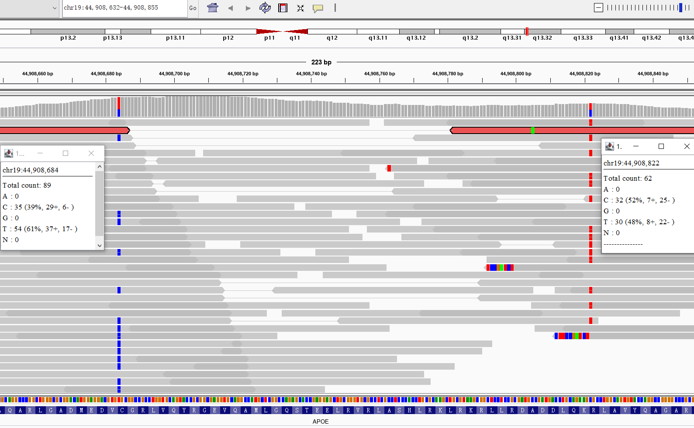
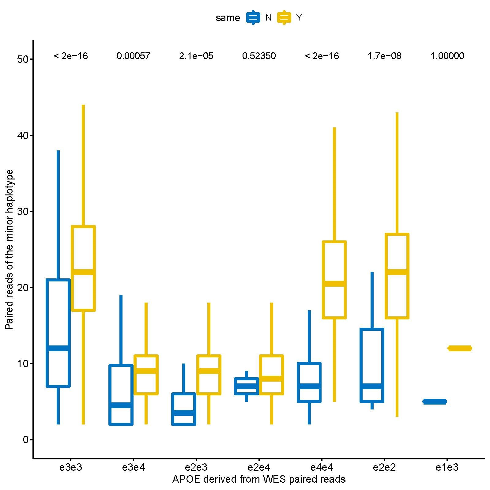

# PerHapS: Paired End Reads based HAPlotyping for Sequencing
PerHapS is a new and simple approach to directly call haplotypes from short-read, paired-end WES data
Author: Jie Huang, MD, PhD, Department of Global Health, Peking University School of Public Health


The technical bottleneck in direct haplotype calling from short-read sequencing lies in the length of sequenced DNA fragments, often too short to include two or multiple variable nucleotide positions that define the haplotype of interest. Indeed, while sequencing reads length in UKBB WES data is 76bp, the two APOE SNPs (rs7412 and rs429358), defining the common APOE polymorphism, are located 138 bp apart. We pieced short reads by utilizing their labels to generate a composite haplotype longer than 138bp.


# Steps:

# #1. download UKB pre-phased genetic data
```
for chr in {1..22} X XY; do

	ukbgene hap -c$chr

	ukbgene hap -c$chr -m
done
```

# #2. download UKB WES data through looping
```
###. only submit 10 jobs each time, and each job downloading 100 samples.
###. extract a certain genetic region such as APOE to save storage space

dir=/restricted/projectnb/ukbiobank # based directory.

pwd=`pwd`

awk '{print $1,"23164_0_0"}' $dir/fe.fam | split -d -a 3 -l 100 - list

cnt=0

for dat in `ls list*`; do
	
	let "cnt=$cnt+1"        
	
	let "gp=($cnt-1)/9"
        
	let "gp2=$gp +1"
        
	if [[ $gp2 == 1 ]]; then
        
		qsub_str="-N g$gp2.$cnt"
        
	else
                
		qsub_str="-N g$gp2.$cnt -hold_jid g$gp.*"
        
	fi
        
	raw=${dat/list/raw}
        
	outdir=$dir/BAM/$raw; mkdir -p $outdir
        
	mv $pwd/$dat $outdir
        
	echo "#!/bin/bash -l
        
	echo -n > $dat.res.txt
        
	module load samtools
        
	sed 's/23164/23163/' $dat > $dat.2
        
	ukbfetch -a$dir/files/ukb.key -b$dat
        
	ukbfetch -a$dir/files/ukb.key -b$dat.2
        
	for d in \`awk '{printf \" \"\$1}' $dat\`; do
        
		mv \${d}_23163_0_0.cram \$d.cram
        
		mv \${d}_23164_0_0.cram.crai \$d.cram.crai
                
		samtools view -L $dir/files/apoe.b38.bed -O BAM -o \$d.bam \$d.cram; samtools index \$d.bam; rm \$d.cram*
                
        done
    
    	" > $outdir/$dat.cmd
        
	cd $outdir
        
	qsub -P ukbiobank $qsub_str -o $dat.LOG -e $dat.ERR < $dat.cmd

done
```

# #3. run the following code to piece together haplotypes from WES



```
gendir=/mnt/d/projects/001UKB # the master directory that holds UKB genotic data

snps="rs429358 rs7412"
chr=19; begin=44908684; end=44908822 # GRCh38 positions 

###. extract haplotype from phased data ###
echo $snps | tr ' ' '\n' > snps.txt

plink2 --pfile $gendir/hap/chr$chr --extract snps.txt --export vcf id-paste=iid bgz --out hap; tabix hap.vcf.gz
zcat hap.vcf.gz | awk '$1 !~/##/' | datamash -W transpose > hap.tmp
sed '1,9d; s/|/ /g' hap.tmp | awk '{print $1, $2$4, $3$5}' > hap.txt
sed 's/ 00/ e1/g; s/ 10/ e2/g; s/ 11/ e3/g; s/ 01/ e4/g; s/ //2' hap.txt > apoe.hap.txt

###. piece haplotype based on paired end reads ###

echo -e "$chr\t$begin\t$end" > loc.bed

for dat in 2244305; do # 1466576
  
  for chr in 20; do # {1..22}; do
    
    samtools view ${dat}_23183_0_0.cram chr$chr > $dat.chr$chr.sam # sometimes without "chr"
	  
	  awk '{print $9}' $dat.chr$chr.sam | sort -n > mate.len 
	  
	  awk '$6=="151M" && NF==18 {$11="QQ"; if ($1 in reads) print reads[$1]" "$0; reads[$1]=$0}' $dat.chr$chr.sam > $dat.chr$chr.tmp.sam
	  
	  awk 'NF !=36 || $4 > $22 {print NR, $4, $22}' $dat.chr$chr.tmp.sam | head # sanity check 
	  
	  awk -v d=$dat '{print d, $1, $3, $4, $22, $22-$4}' $dat.chr$chr.tmp.sam | sort -k 6n > $dat.chr$chr.pairs.len
	  
	  awk -v d=$dat -v b=$begin -v e=$end '{pos1=b-$4+1; pos2=e-$22+1; if (pos1>=1 && pos1<=76 && pos2>=1 && pos2<=76) \
	  	
		{ split($10,seq1,""); split($28,seq2,""); print d, seq1[pos1] "-" seq2[pos2]}}' $dat.tmp.sam > $dat.hap
  
  done

done
```

# #4. run Perhaps.R and more analyses to explore the haplotypes



