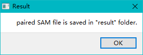
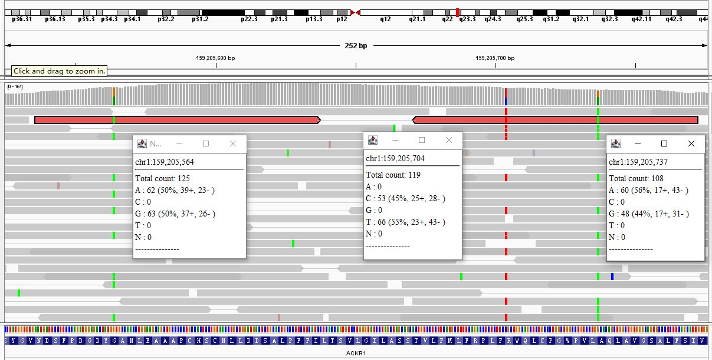

# PerHAPS (Paired-End Reads HAPlotyping for Sequencing)
A new and simple approach to directly call haplotypes from short-read, paired-end next generation sequencing data. 
Author: Jie Huang, MD, PhD, Department of Global Health, Peking University School of Public Health


Please cite: Jie Huang, Stefano Pallotti, Qianling Zhou, Marcus Kleber, Xiaomeng Xin, Daniel A. King, Valerio Napolioni. PERHAPS: Paired-End Reads HAPlotyping for Sequencin. Briefings in Bioinformatics. DOI:10.1093/bib/bbaa320


# Steps:

# #1. Download sequencing data and extract regions of interest

```

id=NA20525
wget ftp.sra.ebi.ac.uk/vol1/run/ERR323/ERR3239807/$id.final.cram
samtools index $id.final.cram
samtools view -H XXX.cram | grep "SN:" | head -25 # check if the target BAM file XXX.cram has "chr" prefix

echo "1 159204012 159206500 ACKR1" > subset.bed
echo "19 44905781 44909393 APOE" >> subset.bed
sed -i 's/ /\t/g' subset.bed
samtools view -L subset.bed -O BAM -o $id.subset.bam $id.final.cram

```


# #2. Linux version, only the first 3 lines need to be changed

```
id=NA19146 ## sample ID
bamfile=$id.bam ## the location of the BAM or CRAM file, indexed
SNPs=19:44908684-44908822 ## the chr and positions of SNPs for phasing.

chr=${SNPs/:*/} # extract "chr" from the "SNPs" defined above 
pos=${SNPs/*:/} # extract "positions" of the "SNPs" defined above 
samtools view -O SAM -o $id.sam $bamfile chr$chr # extract the specified CHR and convert to SAM format   
readlen=`awk 'NR==1 {printf length($10)}' $id.sam`  # find the read length of the sequencing data

# remove reads with soft sequencing, extract first 10 fields
cut -f 1-10 $id.sam | awk '$6 !~/S/ {if ($1 in reads) print reads[$1]" "$0; reads[$1]=$0}' > $id.sam.paired 

# sanity check of haplotype size range formed by paired reads
awk '{if ($9<0) print -$9; else print $9}' $id.sam.paired | uniq | sort -n | uniq  > hap.len 

# this is the core script for PERHAPS
awk -v readlen=$readlen -v pos=$pos '{
	printf NR" "$1" ";
	split(pos,pa,"-");
	cnt=0; hap="";
	for (i in pa) {
		pos1=pa[i]-$4+1; 
		pos2=pa[i]-$14+1;
		if (pos1>=1 && pos1<=readlen) { split($10,seq1,""); printf "-SNP"i"-left("seq1[pos1]")" };
		if (pos2>=1 && pos2<=readlen) { split($20,seq2,""); printf "-SNP"i"-right("seq2[pos2]")" };
		if ((pos1>=1 && pos1<=readlen) || (pos2>=1 && pos2<=readlen)) cnt++; else printf "<>NA"
	};
	print " "cnt
}' $id.sam.paired | sed -e 's/-left//g' -e 's/-right//g' | sort -k 4,4nr -k 1,1n > $id.hap


# report the haplotypes that include all input SNPs
num=`echo $SNPs |  awk '{print gsub("-","") +1}'`
awk -v num=$num '$NF==num {$1=$2=""; print $0}' $id.hap | sort | uniq -c

# create a subset SAM file that only includes the reads that form the haplotype mentioned above, for IGV visualization
awk -v num=$num '$NF==num {print $2}' $id.hap > $id.subset.reads
fgrep -wf $id.subset.reads $id.sam > $id.subset.sam

```


# #3. Windows and GUI version

The Windows version includes awk.exe, cut.exe, samtools.exe, sort.exe, uniq.exe are needed, which are put under the windows-tools folder.
First, download perhaps_gui.exe and windows_tools directory. 
Then, put them in the same directory (not putting perhaps_gui.exe into the windows_tools directory)


The Windows version could also be called from the Windwos command terminal, as shown in the following example command.
```
python perhaps.py -i NA20525 -d .\test-data -s 1:159205564-159205704-159205737
```

Click perhaps_gui.exe to run the GUI version.
The default value is pre-filled, and users only need to click the "submit" button to get the same results as above.
Below are the screenshots of the GUI version.
 





!! If users could not see the above images in browser,  this is due to "DNS cache pollution". One short term fix for Windows users is to replace the "hosts" file (usually in "C:\Windows\System32\drivers\etc\hosts") with the "hosts" file posted on this site.


# #4. Visualize and validate the directly called haplotypes

PerHAPS outputs a subset of the input BAM file that only contains paired short reads that are informative for the input haplotype.
Users could use IGV (http://www.igv.org/) to visualize the input BAM file and the output subset BAM file. 
 



# #5. Testing other phasing software
align VCF and BAM files to the same genome build

```
id=NA20525 # an example sample from G1K
  
# whatshap (https://whatshap.readthedocs.io/en/latest/)
  whatshap phase -o $id.whatshap.vcf --no-reference $id.vcf.gz $id.bam

# HapCUT2 (https://github.com/vibansal/HapCUT2)**	
  extractHAIRS --bam $id.bam --VCF $id.vcf --out $id.fragment
  HAPCUT2 --VCF $id.vcf --fragments $id.fragment --output $id.hap

# Smart-Phase (https://github.com/paulhager/smart-phase)
  java -jar smartPhase.jar -a $id.vcf.gz -p $id -g apoe.b38.bed -r $id.bam -m 60 -x -vcf -c 0.1 -o $id.tsv  

```


# #6. Scripts for processing the UKB data

#6.1. Download and extract the APOE gene region of UKB WES files (N ~ 50,000)

The UKB server allows no more than 10 jobs to download the WES 
