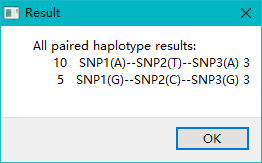
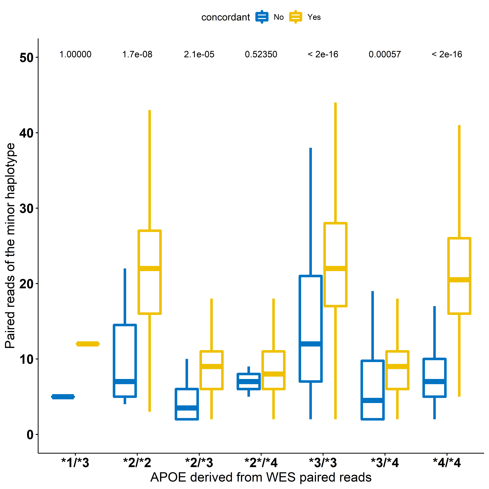

# PerHAPS (Paired-End Reads based HAPlotyping for Sequencing)
A new and simple approach to directly call haplotypes from short-read, paired-end next generation sequencing data. 
Author: Jie Huang, MD, PhD, Department of Global Health, Peking University School of Public Health


The technical bottleneck in direct haplotype calling from short-read sequencing lies in the length of sequenced DNA fragments, often too short to include two or multiple variable nucleotide positions that define the haplotype of interest. Indeed, while sequencing reads length in UKBB WES data is 76bp, the two APOE SNPs (rs7412 and rs429358), defining the common APOE polymorphism, are located 138 bp apart. We pieced short reads by utilizing their labels to generate a composite haplotype longer than 138bp. For illustraton purpose, we downloaded the WES data of two samples: HG01173 NA20525.


# Steps:

# #1. download sequencing data and extract regions of interest

```
samtools view -H XXX.cram | grep "SN:" | head -25 # check if the target BAM file XXX.cram has "chr" prefix
echo "1 159204012 159206500 ACKR1" > subset.bed
echo "19 44905781 44909393 APOE" >> subset.bed
sed -i 's/ /\t/g' subset.bed
echo "rs2814778 rs12075 rs34599082 rs13962 rs429358 rs7412" | tr ' ' '\n' > subset.snps
```

#1.1 download UKB WES data for sample 1466576, an example for APOE haplotype (Figure 1). assuming .ukbkey file created

```
id=1466576
echo -e "19416\nXXXXXX" > .ukbkey # XXXX is the UKB data key 
echo -e "$id 23163_0_0\n1466576 23164_0_0" > sample.id
ukbfetch -bsample.id
samtools view -L subset.bed -O BAM -o $id.subset.bam $id.cram
samtools addreplacerg -r ID:$id -r SM:$id -O BAM -o $id.bam $id.subset.bam
samtools index -o $id.bam
```

#1.2 download G1K WGS data for sample NA20525, an example for ACKR1 haplotype
#full G1K WGS data at https://www.internationalgenome.org/data-portal/data-collection/30x-grch38 

```
id=NA20525
wget ftp.sra.ebi.ac.uk/vol1/run/ERR323/ERR3239807/$id.final.cram
samtools index $id.final.cram
samtools view -L subset.bed -O BAM -o $id.subset.bam $id.final.cram
```

#1.3 download G1K VCF file, as needed by some other phasing programs such as WhatsHap. 
#the following code uses chromosome 1 as an example.

```
wget ftp://ftp.1000genomes.ebi.ac.uk/vol1/ftp/release/20130502/ALL.chr1.phase3_shapeit2_mvncall_integrated_v5a.20130502.genotypes.vcf.gz
mv ALL.chr1.phase3_shapeit2_mvncall_integrated_v5a.20130502.genotypes.vcf.gz chr1.vcf.gz
seq 1 22 | xargs -n1 -I % echo % chr% > chr_name_conv.txt

# rename chromosome to add "chr" prefix, if needed
bcftools annotate chr1.vcf.gz --rename-chrs chr_name_conv.txt -Oz -o chr1.vcf.gz

# convert from build 37 positions to build 38 positions, if needed
gatk --java-options "-Xmx6g" LiftoverVcf -R Homo_sapiens_assembly38.fasta.gz -I chr1.vcf.gz -O chr1.b38.vcf.gz \
	-C hg19ToHg38.over.chain --REJECT rejected.vcf --DISABLE_SORT true

# create a small VCF subset, keeping only those samples of interest.
echo "NA20525" > sample.keep
plink2 --vcf chr1.vcf.gz --extract subset.snps --keep sample.keep --export vcf bgz id-paste=iid --out chr1.subset

```


# #2. test other software
#2.1 whatshap https://whatshap.readthedocs.io/en/latest/

```
conda config --add channels bioconda
conda config --add channels conda-forge
conda install whatshap nomkl
whatshap phase -o phased.vcf --no-reference NA20525.vcf.gz NA20525.bam
```

#2.2 HapCUT2: https://github.com/vibansal/HapCUT2

```
#the VCF and BAM files need to be on the same genome build (such as GRCh38)
id=NA20525
HapCUT2/build/extractHAIRS --bam $id.wgs.subset.bam --VCF $id.vcf  --out $id.fragment
HapCUT2/build/HAPCUT2 --fragments $id.fragment --VCF $id.vcf --output $id.hap

```

#2.3 Smart-Phase: https://github.com/paulhager/smart-phase

```
java -jar smartPhase.jar -a NA20525.vcf.gz -r NA20525.loc.bam -p NA20525 -g loc.bed \
 -m 60 -x -t -vcf -c 0.1 -o NA20525.tsv
```


# #2. PerHAPS in LINUX, only the first 3 lines need to be changed

```
IID=NA20525 ## sample ID
rawfile=../BAM/$IID.bam ## the location of the BAM or CRAM file, indexed
SNPs=1:159205564-159205704-159205737 ## the chr and positions of SNPs for directy haplotype detection.

chr=${SNPs/:*/} # extract "chr" from the "SNPs" defined above 
pos=${SNPs/*:/} # extract "positions" of the "SNPs" defined above 
samtools view -O SAM -o $IID.sam $rawfile # convert the BAM/CRAM file to SAM format (txt format)   
readlen=`awk 'NR==1 {printf length($10)}' $IID.sam`  # find the read length of the sequencing data

# remove reads with soft sequencing, extract first 10 fields
cut -f 1-10 $IID.sam | awk '$6 !~/S/ {if ($1 in reads) print reads[$1]" "$0; reads[$1]=$0}' > $IID.sam.paired 

# sanity check of haplotype size range formed by paired reads
awk '{if ($9<0) print -$9; else print $9}' $IID.sam.paired | uniq | sort -n | uniq  > hap.len 

# this is the core script for PERHAPS
awk -v readlen=$readlen -v c=$chr -v pos=$pos '$3=="chr"c {
	printf NR" "$1" "
	split(pos,pa,"-");
	cnt=0; hap="";
	for (i in pa) {
		pos1=pa[i]-$4+1; pos2=pa[i]-$14+1;
		if (pos1>=1 && pos1<=readlen) { split($10,seq1,""); printf "-SNP"i"-left("seq1[pos1]")" };
		if (pos2>=1 && pos2<=readlen) { split($20,seq2,""); printf "-SNP"i"-right("seq2[pos2]")" };
		if ((pos1>=1 && pos1<=readlen) || (pos2>=1 && pos2<=readlen)) cnt++; else printf "<>NA"
	};
	print " "cnt
}' $IID.sam.paired | sed -e 's/-left//g' -e 's/-right//g' | sort -k 4,4nr -k 1,1n > $IID.hap


# report the haplotypes that include all input SNPs
num=`echo $SNPs |  awk '{print gsub("-","") +1}'`
awk -v num=$num '$NF==num {$1=$2=""; print $0}' $IID.hap | sort | uniq -c

# create a subset SAM file that only includes the reads that form the haplotype mentioned above, for IGV visualization
awk -v num=$num '$NF==num {print $2}' $IID.hap > $IID.subset.reads
fgrep -wf $IID.subset.reads $IID.sam > $IID.subset.sam

```


# #3. Windows Version of PERHAPS

We also developed a script that could be run on Windows OS. The tools including awk.exe, cut.exe, samtools.exe, sort.exe, uniq.exe are needed, which are put under the windows-tools folder.
To run a test, you can input `python perhaps.py -i NA20525 -d .\test-data -s 1:159205564-159205704-159205737` on Windows cmd.


# #4. GUI version of PERHAPS

First, download perhaps_gui.exe and windows_tools directory. 
Then, put them in the same directory (not putting perhaps_gui.exe into the windows_tools directory)
Then, click perhaps_gui.exe to run the GUI version.
The default value is pre-filled, and users only need to click the "submit" button to get the same results as above.
Below are the screenshots of the GUI version.
 





!! If users could not see the above images in browser,  this is due to "DNS cache pollution". One short term fix for Windows users is to replace the "hosts" file (usually in "C:\Windows\System32\drivers\etc\hosts") with the "hosts" file posted on this site.


# #5. Visualize and validate the directly called haplotypes

Researchers could then open IGV (http://www.igv.org/) to visualize the genomic region in study and also visualize the directly called haplotype
 


# #6. Extract statistically phased haplotypes from UKB

```
gendir=XXX # the directory for the UKB haplotypes file
snps="rs429358 rs7412"
chr=19; begin=44908684; end=44908822 # GRCh38 positions for two SNPs that define the APOE haplotype

###. extract haplotype from phased data ###
echo $snps | tr ' ' '\n' > snps.txt

plink2 --pfile $gendir/hap/chr$chr --extract snps.txt --export vcf id-paste=iid bgz --out hap; tabix hap.vcf.gz
zcat hap.vcf.gz | awk '$1 !~/##/' | datamash -W transpose > hap.tmp
sed '1,9d; s/|/ /g' hap.tmp | awk '{print $1, $2$4, $3$5}' > hap.txt
sed 's/ 00/ e1/g; s/ 10/ e2/g; s/ 11/ e3/g; s/ 01/ e4/g; s/ //2' hap.txt > apoe.hap.txt

```


# #7. Compare PERHAPS detected haplotypes vs. statistically phased haplotypes

Run perhaps.R to generate the following plot




# #8. Download and extract the APOE gene region of UKB WES files (N ~ 50,000)

The UKB server allows no more than 10 jobs to download the WES data simultaneously for each approved project. 
Therefore, to download ~50,000 WES samples, we designed a strategy to put create ~500 list files, each containing links for 100 WES files.
Then we use LSF to run 9 ukbgene jobs in a batch, and put the other jobs in batches of 9 jobs, and waiting on the queue.
To save disk space, we delete the downloaded raw genotypic data after extracting the target regions.

```

dir=XXXX # the root directory for data
pwd=`pwd` # find the current dictory in a variable
awk '{print $1,"23164_0_0"}' $dir/data/ukb/wes/fe.fam | split -d -a 3 -l 100 - list  # extract the sample list from the WES plink file.


cnt=0 # this counting variable will be used in the following loop

for dat in `ls list*`; do  # to loop through all the list* files generated by the "split" command above
	
	let "cnt=$cnt+1"  # increase the count by 1
	let "gp=($cnt-1)/9"  # group every 9 jobs into a batch
	let "gp2=$gp +1"
	if [[ $gp2 == 1 ]]; then
		qsub_str="-N g$gp2.$cnt" 
	else
		qsub_str="-N g$gp2.$cnt -hold_jid g$gp.*"  # wait till the previous batch of jobs finished
	fi

	raw=${dat/list/raw}  
	outdir=$dir/data/ukb/wes/BAM/$raw; mkdir -p $outdir  # create a new folder for each group of downloading files
	mv $pwd/$dat $outdir
	
	echo "#!/bin/bash -l
	module load samtools
	sed 's/23164/23163/' $dat > $dat.2  # use the new data-field 23163 to download the associated cram.crai file.
	ukbfetch -b$dat  # !!! this line to actually download the .cram file
	ukbfetch -b$dat.2 # !!! this line to actually downoad the .cram.crai file
	for d in \`awk '{printf \" \"\$1}' $dat\`; do
		mv \${d}_23163_0_0.cram \$d.cram  # rename the file to a simpler name
		mv \${d}_23164_0_0.cram.crai \$d.cram.crai 
		samtools view -L $dir/files/apoe.b38.bed -O BAM -o \$d.bam \$d.cram # !!! this line extract the target region from the downloaded raw file 
		samtools index \$d.bam; rm \$d.cram*
		rm \$d.bam \$d.bam.bai # remove the downloaded raw file to save disk space.
	done
	" > $outdir/$dat.cmd
	
	cd $outdir
	qsub $qsub_str -o $dat.LOG -e $dat.ERR < $dat.cmd

done

```

